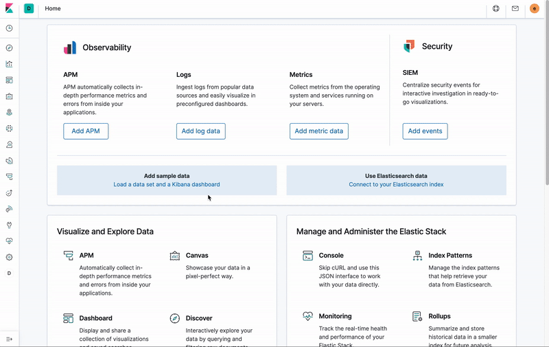

# Docket

Docket is a web Frontend to Google Stenographer

  

---

## Setup

The following is based on the assumption that you already have Stenographer installed with gRPC enabled.

Testing has only been done against the master branch of Kibana. See [this article](https://github.com/elastic/kibana/blob/master/CONTRIBUTING.md#setting-up-your-development-environment) for instructions on creating a Kibana development environment.

1. Download this repo to `kibana/plugins/docket`

2. Create `/etc/docket/config.yaml` with the following contents, substituting your own information:

```
certPath: '/etc/docket/certs'
pcapPath: '/tmp/docket'
```
